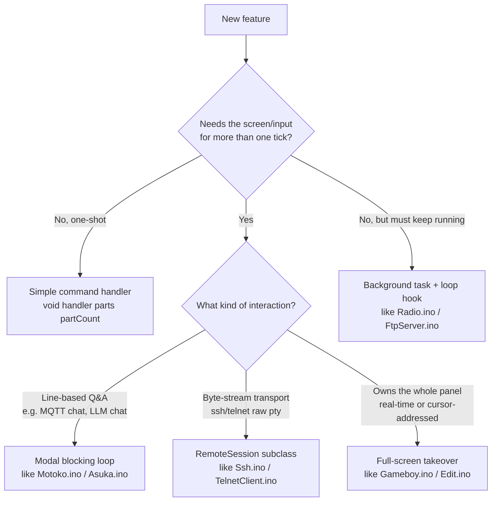

# DOLL-OS API Guide

A reference for writing new applications (commands, modal tools, remote-session
clients, full-screen takeovers) against DOLL-OS's internal C++ APIs on this
board. Companion to [`PORTING.md`](PORTING.md), which explains what this fork
changed relative to the upstream M5Cardputer build and why; this document is
about the functions you actually call. For the `.dapp` script runtime — a
separate, non-C++ way to add an app — see [`DAPP.md`](DAPP.md).

Everything below lives directly in the sketch's `.ino`/`.h` files — there is no
package boundary, so "the API" just means "functions and globals declared
somewhere in this sketch that other files already call." Signatures are quoted
verbatim from source as of this writing.

> **If you're coming from upstream DOLL-OS:** the two files you knew best are
> gone. `terminal.ino` split into `Output.ino` (line output) and `Display.ino`
> (the TFT mirror); `hardware.ino` became `TelnetServer.ino` +
> `KeyboardSerial.ino`. `addWrappedHistoryLine(...)` is now `outLine(...)`,
> `readKeyboard(String&)` is now `readLineEditedInput(String&)`, and colors are
> ANSI SGR ints (`C_RED`) rather than 16-bit pixel constants at the call site.

## 1. Mental model

DOLL-OS is one cooperative loop (`DS.ino`). There's no task system for features,
no event bus, no plugin registry — but there are now five distinct shapes a
feature can take:



Two surfaces exist and almost everything writes to both: a connected **telnet
client** (the primary remote UI) and the board's **TFT panel**, which mirrors the
same session. Two input sources feed the same buffers: the telnet socket and the
**DS-Slave BLE-keyboard bridge** over UART. Neither surface nor source is
required — the board is fully usable with no telnet client attached, and equally
usable with no keyboard paired.

## 2. Global state (`global.h`)

Declared once, used everywhere. The ones you'll actually touch:

| Symbol | Type | Meaning |
|---|---|---|
| `telnetClient` | `WiFiClient` | the one connected user, if any — always guard writes with `telnetClient && telnetClient.connected()` |
| `currentCommand` | `String` | top-level shell's live input buffer |
| `commandCursorPos` | `int` | cursor index into whichever buffer is currently being line-edited (shared — only one is ever active) |
| `COMMAND_MAX_LEN` | `const int` | 256; cap on any single line-edited buffer |
| `activeInputPrompt` / `activeInputText` / `activeInputMasked` | `String`/`String`/`bool` | what the panel's mirrored command bar shows — set them through `setActiveInput()`, never directly |
| `cwd` | `String` | current working directory in the unified storage namespace |
| `SD_MOUNT` | `const String` | `"/sd"` — where the SD card appears in that namespace |
| `sdCardMounted` | `bool` | set by `initStorage()` |
| `displayDirty` | `bool` | set via `markDisplayDirty()`; `drawDisplayFrame()` skips its redraw+SPI push unless this (or a blink/status timer) is due |
| `displayScrollOffset` | `int` | how far back the panel is scrolled from the live tail; 0 = pinned |
| `dappCanvasActive` | `bool` | swap the panel's terminal area for a `.dapp` canvas grid |
| `C_RESET`, `C_WHITE`, `C_RED`, `C_GREEN`, `C_YELLOW`, `C_BLUE`, `C_MAGENTA`, `C_CYAN`, `C_PINK` | `const int` | ANSI SGR codes — the color vocabulary for `outLine()` |
| `RADIO_VOLUME_MAX` | `const int` | 21; one notion of loudness for radio *and* the Game Boy APU |
| `rearLedAvailable()`, `rearLedSetRgb()`, `rearLedSetRgbLong()`, `rearLedOff()` | functions | shared rear RGB LED control surface for native modules and AppRunner (`LED` opcode); no-op on builds where LED support is disabled |
| `LineInputResult` / `LineEditState` | enum / struct | one line-editor call's result, and per-input-source escape/CR parse state |
| `RoutedPath` | struct | `{ fs::FS* fs; String realPath; bool isSd; }` |
| `AnsiFilterState`, `DisplayStreamState`, `DisplayEraseKind` | structs/enum | display-side filtering and incremental row building for raw byte streams |
| `RemoteSession` | class | base class for raw byte-stream modal sessions (§8) |
| `EditKey`, `EditKeyState`, `DappProgram` & friends, `DappKeyState`, `HeapCheckpoint` | | types owned conceptually by one file but declared here — see the hoisting note in §15 |

Anything you add that a hoisted function signature needs to reference (a struct
used as a parameter type, for instance) has to go in `global.h` too, for the
same reason. That includes the `static` functions of a single `.ino` — the
Arduino builder hoists prototypes for those too.

## 3. Line output API (`Output.ino`)

This is the API almost every command handler uses to produce output. It writes
to **both** surfaces: real ANSI to the telnet socket, pixel-wrapped rows to the
panel's history ring.

```cpp
void outLine(const String& text);              // white
void outLine(const String& text, int color);   // color is an SGR code: C_RED, C_CYAN, ...
```
The direct replacement for upstream's `addWrappedHistoryLine()` at every call
site. Wrapping is the panel's problem (`addDisplayLine` measures glyph widths);
the telnet client wraps for itself.

```cpp
void outClearScreen();
```
Clears both: `clearDisplayHistory()` on the panel, `CSI 2J` + `CSI H` on the
socket. This is what the `clear` command runs.

```cpp
String shellPrompt();                        // path-aware: "/sd/roms > ", elided past 24 chars
void printPrompt();                          // writes shellPrompt() to the telnet client only
void echoCommandLine(const String& entered);
```
`shellPrompt()` is the single source of truth for the three places a prompt
appears (telnet prompt, panel command bar, command echo), so all three agree on
where "here" is after a `cd`. `echoCommandLine()` puts a submitted command into
the scrollback in cyan; `commandProcessor()` already calls it, so you only need
it if you're building a second dispatch surface.

**Colors:** pass the `C_*` SGR ints from `global.h`. `Display.ino`'s
`ansiCodeToPixelColor(int)` maps them onto `TFT_*` pixel colors for the mirror,
so a line looks roughly the same on both surfaces.

## 4. Display mirror API (`Display.ino`)

You rarely call these directly — `outLine()` covers ordinary output — but modal
apps and takeovers need them.

```cpp
void drawDisplayFrame();   // rebuild + push one frame, if anything is dirty/due
void markDisplayDirty();
void pushDisplayFrame();   // blit frameSprite to the panel (variant-agnostic)
```
`drawDisplayFrame()` runs once per `DS.ino` `loop()` tick. **Any loop that
blocks `loop()` must call it itself** (see §7, §8) or the panel freezes for the
duration. It early-outs when nothing changed, so calling it liberally is cheap.

```cpp
void setActiveInput(const String& prompt, const String& text, bool masked);
```
The single entry point for the mirrored command bar — sets the three
`activeInput*` globals and marks the frame dirty in one step. Call it after
every edit in a modal loop. `masked=true` renders `*` per character (ssh's
password prompt).

```cpp
void addDisplayLine(const String& line);                    // wraps at panel width
void addDisplayLine(const String& line, uint16_t color);
void addDisplayHistoryRow(const String& row, uint16_t color);   // exactly one row, no wrapping
void updateLastDisplayHistoryRow(const String& row, uint16_t color);
void clearDisplayHistory();
void displayScrollBy(int delta);   // +1 = one line further back, -1 = toward the live tail
uint16_t ansiCodeToPixelColor(int code);
```
Colors here are `TFT_*` constants (`TFT_WHITE`, `TFT_RED`, `TFT_PINK`, ...), not
SGR ints. History is a 200-row ring of fixed 128-char rows
(`DISPLAY_HISTORY_ROW_MAX_CHARS`), allocated in PSRAM at boot — longer rows are
truncated with an ellipsis, not wrapped, at that layer.

`frameSprite` (a full-screen `TFT_eSprite`, `global.h`) is the drawing target
for everything. A takeover may borrow it freely and push with
`pushDisplayFrame()`; `drawDisplayFrame()` rebuilds it from scratch whenever
`displayDirty` is set, so nothing is lost. That path is panel-variant-agnostic —
drawing to the raw `tft` object instead (as `Gameboy.ino` does) only compiles on
the SPI variants.

## 5. Input APIs (`TelnetServer.ino`, `KeyboardSerial.ino`, `RemoteSession.ino`)

There are two input sources and two input modes. **Both sources must be polled**
by anything that blocks `loop()`, or the feature works over telnet but not from
the BLE keyboard (or vice versa).

### Line-edited input

```cpp
LineInputResult readLineEditedInput(String& text);          // telnet source
LineInputResult readKeyboardLineEditedInput(String& text);  // DS-Slave keyboard source
// enum LineInputResult { LINE_NO_INPUT, LINE_EDITING, LINE_SUBMITTED };
```
The shared input primitive every buffered-input feature reads through — the role
upstream's `readKeyboard()` played. Each call consumes **at most one** semantic
input unit (one printable char, one control action, or one escape sequence) and
edits `text` in place, indexed by the shared `commandCursorPos`. Edits are never
echoed over the wire: the live view of the buffer is the panel's command bar, so
call `setActiveInput()` after every call.

```cpp
LineInputResult processLineEditByte(String& text, uint8_t ch, LineEditState& st,
                                     bool echoCrlfToTelnet);
```
The byte-source-agnostic core both of the above call. Use it directly when you
have your own byte source or need your own parse state — `RemoteSession`'s
inline command prompt does exactly this so a half-typed command can't tangle
with the shell's state. Give every independent input path its own
`LineEditState`.

Chords the line editor implements: Up/Down recall command history (one shared
ring, whatever buffer is being edited), Left/Right move the cursor, Delete
(`ESC[3~`) deletes forward, Backspace/DEL delete back, Ctrl+C cancels the line,
Ctrl+Up/Down nudge radio volume, Shift+Up/Down scroll the panel's history. Other
CSI sequences are silently dropped.

### Raw byte input

```cpp
int telnetReadFilteredByte();   // one byte, IAC negotiation consumed; -1 if none
int keyboardReadRawByte();      // one byte from the DS-Slave UART; -1 if none
int keyboardPeekRawByte();      // same, without consuming (the .dapp abort check uses this)
```

```cpp
bool readRawUserBytes(String& outBytes, bool& escapePressed,
                      bool& backspacePressed, bool& cmdModePressed);
```
The raw-session classifier: reads telnet first, falls back to the keyboard
bridge, and returns bytes to forward verbatim — except **Ctrl+T** (`0x14`, sets
`escapePressed`, the universal detach chord), **Ctrl+K** (`0x0B`, sets
`cmdModePressed`, "run one shell command without detaching"), backspace/DEL
(sets `backspacePressed` so each transport translates it via its own
`backspaceBytes()`), and the Ctrl+Up/Down and Shift+Up/Down sequences, which are
consumed locally for volume and scroll. You won't normally call this — it's what
`RemoteSession::run()` calls on your behalf (§8).

## 6. Writing a simple command

A command is a function plus one line in a dispatch table.

**Handler signature**, always:
```cpp
void handleFooCommand(const String parts[], int partCount);
```
`parts[0]` is the command name itself; `parts[1..7]` are up to seven
space-delimited arguments. `commandProcessor()` expands aliases, then calls
`splitCommand(dispatchCommand, parts, 8)` against a `String parts[8]`, so eight tokens
is the hard ceiling — a command needing more has to parse them itself out of
`parts[1]` onward, or that one call site has to change.

**Register it** in `commandTable[]` (`CommandProcessor.ino`), kept alphabetical
by convention, and add it to `helpCommandHandler`'s text:
```cpp
static const CommandEntry commandTable[] = {
    { "apps",   handleAppsCommand },
    { "asuka",  handleAsukaCommand },
    { "foo",    handleFooCommand },   // <- add here, alphabetically
    ...
};
```
Before lookup, `commandProcessor()` expands a matching shell alias from
`/system/conf/alias.dsys` (`nano foo` becomes `edit foo`). Lookup is then a linear scan
(`parts[0] == commandTable[i].name`), exact match, case-sensitive. `clear` is the one exception — handled inline in
`commandProcessor()` because it clears both surfaces directly rather than going
through the table. An unmatched word prints `Unknown command: ...` in red.

**Minimal worked example** (`Dice.ino` is the reference "hello world" — small,
stateless, colored output):
```cpp
void handleDiceCommand(const String parts[], int partCount) {
    int diceSides = 6, diceNumber = 1;
    if (partCount == 1) { diceHelp(); return; }
    if (parts[1].length() != 0) diceSides  = parts[1].toInt();
    if (parts[2].length() != 0) diceNumber = parts[2].toInt();
    diceRoll(diceSides, diceNumber);
}
```

For subcommands (multi-mode commands like `wifi`, `ip`, `radio`, `ftp`, `slave`),
branch on `parts[1]` inside the handler — see `handleWifiCommand` /
`handleRadioCommand` for the established pattern, including the bare-command
"print status" default and a `...Help()` fallback for anything unrecognized.

## 7. Building a modal (blocking) application

For a feature that needs the session for an extended, multi-step, **line-based**
interaction — not a raw byte-stream transport — follow `Motoko.ino`'s shape
(`Asuka.ino` is the larger example of the same skeleton):

1. Module-level state: an input-mode enum, your own `String` input buffer
   (never reuse `currentCommand` — that belongs to the top-level shell), and
   whatever session state your feature needs.
2. `static String fooPrompt()` — the label for whichever phase you're in.
3. `void runFooBlocking()` — the modal loop:
   ```cpp
   void runFooBlocking() {
       while (true) {
           delay(10);
           // ... poll your backend/transport, non-blocking ...

           //poll BOTH input sources: this loop owns loop(), so nothing else will
           LineInputResult r = readLineEditedInput(fooInputBuffer);
           if (r == LINE_NO_INPUT) {
               r = readKeyboardLineEditedInput(fooInputBuffer);
           }
           setActiveInput(fooPrompt(), fooInputBuffer, false);
           drawDisplayFrame();   //loop() isn't ticking -- repaint the mirror here

           if (r == LINE_SUBMITTED) {
               if (fooInputBuffer == "/quit") break;   //local exit convention
               fooHandleEnteredLine();
               fooInputBuffer = "";
               commandCursorPos = 0;
               setActiveInput(fooPrompt(), fooInputBuffer, false);
               telnetClient.print(fooPrompt());
           }
       }
   }
   ```
4. `void handleFooCommand(parts, partCount)` — validate preconditions (e.g.
   `WiFi.status() == WL_CONNECTED`), reset your state, print an intro line,
   write your first prompt, run `runFooBlocking()`, then print an exit line.
   You do **not** need to reprint the shell prompt: `readTelnetClient()` /
   `readKeyboardSerial()` do that after every command returns.

Note the two things that are easy to get wrong: a dropped or absent telnet
client is **not** a reason to exit (the panel + keyboard are a complete UI on
their own), and `commandCursorPos` must be reset alongside your buffer, since
it's shared.

## 8. RemoteSession framework — raw byte-stream apps (`global.h` + `RemoteSession.ino`)

For anything that's really a character-oriented remote transport — a socket
where every keystroke must go out immediately (arrow keys, Ctrl+C,
backspace-before-Enter, full-screen remote programs) — don't hand-roll the loop.
Subclass `RemoteSession` (declared in `global.h`, base loop implemented in
`RemoteSession.ino`); `Ssh.ino`'s `SshShellSession` and `TelnetClient.ino`'s
`TelnetClientSession` are the two existing implementations.

```cpp
class RemoteSession {
public:
    virtual ~RemoteSession() {}
    void run();   // owns the poll/pump/redraw loop + Ctrl+T detach + Ctrl+K inline command
protected:
    virtual void pumpIncoming() = 0;                   // drain transport -> telnetClient, non-blocking
    virtual bool isClosed() = 0;                        // has the remote gone away
    virtual void sendBytes(const String& bytes) = 0;    // forward raw bytes to the remote
    virtual void onClosed() {}                           // one-shot, first time isClosed() is true
    virtual String backspaceBytes() { return "\x7f"; }   // DEL by default; override per transport
};
```

Usage is always: construct a subclass instance, call `.run()`, it blocks until
the remote closes or the user sends **Ctrl+T**. `run()` calls
`drawDisplayFrame()` every iteration for you. There is no `drawInputRow()`
override any more — raw sessions have no local buffer to mirror, so they just
`setActiveInput()` a static hint once before starting.

`backspaceBytes()` matters because transports disagree — a real pty (ssh) wants
DEL (`0x7F`); classic telnet/BBS line editors want ASCII backspace (`0x08`) —
see `TelnetClient.ino`'s override.

**Ctrl+K** runs one shell command mid-session via
`RemoteSession::runInlineCommandPrompt()` (private, not virtual — identical for
every subclass) and returns to raw forwarding. Submitting an empty line is the
"back out" gesture.

### Mirroring a raw stream onto the panel (`Display.ino`)

The telnet client gets the remote's bytes untouched — a real terminal renders
ANSI natively. The panel can't, so the same bytes go through a filter and an
incremental row builder. Use one `AnsiFilterState` + one `DisplayStreamState`
per independent stream (ssh keeps separate pairs for stdout and stderr so they
interleave without corrupting each other):

```cpp
bool ansiFilterByte(AnsiFilterState& st, uint8_t ch, uint16_t defaultColor,
                    uint16_t& color, char& outCh, bool& colorChanged,
                    bool& isBackspace, bool& isCarriageReturn,
                    DisplayEraseKind& erase);
```
Returns `true` when `outCh`/`color` are a real character to display. Otherwise
check `isBackspace` / `isCarriageReturn` / `erase` and call the matching
`displayStream*` function below, or drop the byte if none apply. SGR color is
interpreted; cursor addressing is deliberately dropped (only `m`, `K`, and
`G` with column ≤ 1 survive); multi-byte UTF-8 collapses to a single `?`.

```cpp
void displayStreamReset(DisplayStreamState& st);
void displayStreamPutChar(DisplayStreamState& st, char ch, uint16_t color);
void displayStreamNewline(DisplayStreamState& st);
void displayStreamCarriageReturn(DisplayStreamState& st);
void displayStreamErase(DisplayStreamState& st, DisplayEraseKind kind);
void displayStreamBackspace(DisplayStreamState& st);
```
See `sshPumpStream()` (`Ssh.ino`) or `remoteTelnetMirrorToDisplay()`
(`TelnetClient.ino`) for the canonical wiring of filter → streaming API. The
wrap bookkeeping inside these (`wrapDepth`/`crPending`) exists because the panel
reflows at its own much narrower width than the remote's rows — don't
reimplement it, reuse it.

### Heavy/blocking transports need their own task

`Ssh.ino` runs the entire connect-through-teardown sequence
(`sshConnectAndRun`) on a dedicated FreeRTOS task with a 40 KB stack
(`SSH_TASK_STACK_SIZE`, `xTaskCreatePinnedToCore`), because mbedtls's key
exchange overflows the default ~8 KB loop-task stack and reboots the board.
`handleSshCommand` blocks on a `volatile bool` flag until that task finishes, so
the loop task's own drawing never runs concurrently with the session. Any new
feature pulling in a similarly heavy crypto/TLS/parsing library should follow
this shape rather than calling straight from a command handler.

## 9. Full-screen takeovers (`Gameboy.ino`, `Edit.ino`)

When a feature is real-time (an emulator) or cursor-addressed (an editor), the
mirrored-history model can't carry it — `ansiFilterByte()` drops cursor motion
by design, so a cursor-addressed app cannot travel through the normal output
path at all. Those apps seize `loop()` and own the panel outright.

The pattern:

1. Print a launch line and call `drawDisplayFrame()` to flush it *before* taking
   the panel.
2. Draw into `frameSprite` and push with `pushDisplayFrame()` (`Edit.ino`) —
   panel-variant-agnostic, works on all three FNK0104 variants. Drawing to `tft`
   directly (`Gameboy.ino`, for blit speed) means compiling the app out to a
   stub on the QSPI ST77922 variant.
3. Drain **both** input sources every pass and render once per pass, not once
   per key — a full sprite push is ~38 ms, so rendering inside the key handler
   caps typing at ~26 keys/sec and falls behind telnet bursts.
4. Input does *not* route through `readRawUserBytes()`, so Ctrl+T and Ctrl+K are
   yours to rebind (this is what leaves `^K` free for nano's cut-line).
5. Claim hardware explicitly and give it back: `radioReleaseAudio()` before
   `AudioOut::begin()`, `AudioOut::end()` on exit; `slaveLinkSendLine("GAME 1")`
   to put DS-Slave into held-button gamepad mode and `"GAME 0"` to restore ASCII.
6. On the way out, set `displayDirty = true` and call `drawDisplayFrame()` to
   force a full shell repaint over your frame, then `printPrompt()`.
7. Don't call `radioService()` from a takeover loop — it prints through
   `outLine()` and would scribble across your frame. Announcements queue and
   land after you exit; the radio task itself keeps playing.

## 10. Background services (`Radio.ino`, `FtpServer.ino`)

For a feature that must keep working while the shell is used for other things,
add a non-blocking service function and call it from `DS.ino`'s `loop()`:

```cpp
void ftpService();     // drives the FTP state machine one step when active
void radioService();   // prints whatever the radio task/callbacks stashed
```

`FtpServer.ino` is the simple case: a library state machine ticked once per
loop, toggled by `ftp on` / `ftp off`, non-modal.

`Radio.ino` is the full case — playback runs on a long-lived FreeRTOS task so
audio survives modal sessions and display pushes. The shell never touches the
audio engine directly; it posts to a **one-slot mailbox**
(`RadioCommandKind`: `PLAY`/`PAUSE`/`STOP`/`VOLUME`/`RELEASE`) and the task acts
on it. ESP32-audioI2S's weak callbacks fire *in that task* and only stash
announcements, which `radioService()` prints from the loop task — so the main
loop stays the single writer of the telnet socket and display history. Copy that
discipline for any new background task: **worker tasks must not call
`outLine()`**.

Public surface worth knowing:
```cpp
int  radioGetVolume();            // the status bar reads this every refresh
void radioAdjustVolume(int delta);// the Ctrl+Up/Down chords
bool radioReleaseAudio();         // hand both I2S controllers to a takeover; blocks ~ms
bool audioCodecEnsure();          // bring up the ES8311 without starting a stream
```

## 11. Storage API (`Storage.ino`)

DOLL-OS presents one unified path namespace over two physical filesystems:
LittleFS at the root, and the SD card mounted at `/sd`. The SD card is on the
S3's SDMMC peripheral (4-bit bus, pins in `config.h`), so the backing object is
`SD_MMC`, not `SD`.

```cpp
void initStorage();   // called once from setup(); mounts LittleFS (formatting if corrupt) + SD_MMC
```

```cpp
String resolvePath(const String& cwd, const String& inputPath);
```
Pure string math: collapses `inputPath` (relative or absolute) against `cwd`
into a clean absolute path in the unified namespace, resolving `.`/`..`. Knows
nothing about which filesystem owns the result.

```cpp
RoutedPath routePath(const String& resolvedPath);
// struct RoutedPath { fs::FS* fs; String realPath; bool isSd; };
```
Maps an absolute unified path onto the physical filesystem that owns it —
anything at/under `/sd` routes to `SD_MMC` with the mount prefix stripped,
everything else routes to `LittleFS`.

```cpp
bool directoryExists(const String& resolvedPath);
void listDirectory(fs::FS& fs, const String& path, bool showSdMount);
```

**Pattern for any new command that touches files:** always go
`resolvePath(cwd, userInput)` → `routePath(resolved)` → check
`r.isSd && !sdCardMounted` → then use the standard Arduino `FS`/`File` API
(`r.fs->open(r.realPath, mode)`, `.read()`, `.write()`, `.close()`) — this is
exactly what `handleLsCommand` / `handleCdCommand` / `handleCatCommand` /
`handleCpCommand` already do, and it's what keeps a path like `/sd/foo.txt`
transparently landing on the SD card instead of LittleFS.

Writes that replace an existing file should go through a temp file + rename
rather than a truncating open — this is a battery device, and `Edit.ino`'s save
path is the reference implementation.

`BundledApps.ino`'s `seedBundledApps()` writes firmware-embedded assets
(`BundledApps.h`, regenerated by `tools/regen-bundled-apps.ps1`) into LittleFS at
boot, comparing contents first so an unchanged file isn't rewritten. That's the
mechanism for shipping a default app or doc without a separate filesystem upload.

## 12. Networking APIs

### Wi-Fi (`WiFiManager.ino`)
```cpp
bool connectToInternet();                                          // boot-time join; sweeps the saved list, then config.h defaults
bool connectToSavedNetworks(bool verbose);                         // blocking sweep of the saved list, first match wins
void maintainInternetConnection();                                 // called each loop() tick; bounded 10s reconnect
int  wifiIsConnected();                                            // 1 / 0
void scanWifiNetworks();                                           // blocking scan, prints results
void showWifiStatus();                                             // prints current connection info
void connectWifiNetwork(const String& ssid, const String& password); // blocking, ~15s timeout
void runWifiManagerApp();                                          // the /rom/apps wifi-manager UI, blocks until the user quits

// the saved-network store: /system/conf/wifi.dsys, ordered, `ssid<TAB>password` lines
int  wifiLoadNetworks(WifiCredential networks[], int maxNetworks); // returns how many were read
int  wifiSavedNetworkCount();
bool wifiAddNetwork(const String& ssid, const String& password, bool& added); // adds, or updates in place
bool wifiForgetNetwork(const String& ssid);
bool wifiMoveNetwork(int from, int to);                            // 0-based; changes which network wins

// pre-list shims: "the" credential is just the highest-priority saved network
bool saveWifiCredentials(const String& ssid, const String& password);
bool loadWifiCredentials(String& ssid, String& password);
```
Credentials are an ordered list of up to `WIFI_MAX_SAVED_NETWORKS` (16, in
`global.h`), not a single pair, and **file order is priority order** — every join
path walks it top-down and stops at the first network that answers. A single
`/wifi.cfg` left by older firmware is imported into the list on first read and
then deleted.

`connectToSavedNetworks()` scans first and tries the saved networks the scan saw
before the ones it didn't. That second pass is not optional: a hidden SSID never
appears in scan results at all, so dropping it would make a hidden home network
unjoinable. Priority still decides the winner within each pass — the scan only
decides who gets asked first, and it exists so that being out of range costs
nothing instead of one failed 8s join per saved network.

STA only — the fallback softAP is gone (it starved radio streaming on the S3's
single radio). Three things are load-bearing and easy to undo by accident: the
core's `WiFi.setAutoReconnect(false)` in `connectToInternet()` (left on, a failed
join spins the driver on association forever and every later `scan`/`connect`
fails); `maintainInternetConnection()`'s use of `WiFi.reconnect()` rather than
another `WiFi.begin()` (which the driver rejects mid-connect); and the fact that
its rotation through the saved list only calls `begin()` and never waits on the
result — it runs inside `loop()` *and* inside `appRuntimeYield()`, where a
blocking sweep would stall the shell and any running app.

Call them directly from a new command if you need connectivity, or just check
`WiFi.status() == WL_CONNECTED` yourself the way every existing networked
command does before doing anything blocking.

### IP tools (`IPTools.ino`)
```cpp
void ipShowInfo();                                  // local IP/gateway/subnet/MAC/DNS
void ipScanNetwork();                               // blocking ping sweep of the /24
void ipArpScan();                                   // blocking ARP scan via esp32ARP
void ipComputeRange(byte net[4], byte bcast[4]);    // subnet math helper
String formatMacAddr(const uint8_t* addr);          // "AA:BB:CC:DD:EE:FF"
```

### Ping (`Ping.ino`)
No standalone helper beyond the command handler — it calls the `ESP32Ping`
library's global `Ping` object directly (`Ping.ping(address, count)`,
`Ping.averageTime()`). Do the same from your own code if you need a reachability
check.

## 13. Memory, power, and instrumentation (`SysInfo.ino`)

This board has 8 MB of PSRAM and a comparatively scarce internal SRAM pool that
Wi-Fi, mbedTLS, and DMA must allocate from. Large, long-lived buffers belong in
PSRAM.

```cpp
void* psramOrInternalCalloc(size_t count, size_t size, const char* tag);
void  enablePsramHeap();       // called early in setup(): malloc/new/String >= 512B go to PSRAM
void  reportPsramStatus();
void  recordHeapCheckpoint(const char* tag);   // ring of 16, shown by "free details"
void  reserveHotStrings();     // pre-reserve the buffers that would otherwise realloc constantly
```
Use `psramOrInternalCalloc()` for anything big enough to matter; it logs which
pool actually served the request, and falls back to internal RAM rather than
failing. Note that `enablePsramHeap()`'s 512-byte threshold means a few thousand
small `String`s still land internally — which is why `Edit.ino` uses one flat
PSRAM slab plus a line index rather than an array of `String` lines.

Cold feature storage is lazy as well: the editor's undo records are allocated
with its PSRAM slabs, the FTP server object is constructed in PSRAM only while
FTP is enabled, and ASUKA does not copy its configured defaults until launch.
The Game Boy's CPU-rendered 160x144 framebuffer is PSRAM-backed; only its small
audio scratch buffer stays internal for the I2S path.

The rear status LED is intentionally different: its 24 RMT symbols remain in
internal RAM because the transmitter may access them outside normal cached code.
`Led.ino` uses the Freenove-tested 10 MHz waveform directly instead of the vendor
class, whose fixed 256-pixel member array cost 24,576 bytes for this one-pixel board.

```cpp
float readBatteryVoltage();
int   readBatteryPercent();    // linear LiPo estimate; no fuel-gauge chip on this board
```
Both are real readings off the divided ADC pin (`BATTERY_ADC_PIN`, `config.h`) —
unlike upstream's empty `batteryPercentCheck()` stubs, which don't exist here.
The status bar and the `battery` command both read these.

## 14. DS-Slave link (`KeyboardSerial.ino`, `SlaveLink.ino`, `PadButtons.ino`)

DS-Slave is a companion ESP32-S3 (`../DS-Slave/`) that bridges a BLE HID
keyboard (and optionally a controller) to a UART. Keystrokes arrive on the
`BoardPins.h` RX pin (GPIO21 on AB/S, GPIO46 on N; hardware UART1, RX-only) as
exactly the byte vocabulary the line editor already speaks: printable ASCII,
CR for Enter, `0x08` for Backspace, ESC/CSI for the arrow/Home/End/Delete
cluster, and real control codes for Ctrl+letter.

Above that vocabulary sit private out-of-band bytes, consumed by
`handleKeyboardLinkControl()` before line editing or raw forwarding ever sees them,
so they can never land in an input buffer:

| Byte | Meaning | Handled by |
|---|---|---|
| `0xF4` / `0xF5` | volume up / down | `radioAdjustVolume()` (§12) |
| `0xF6` | paired sleep (rotary **Settings > Sleep**) | `enterSystemLightSleep()` |
| `0xF7` | wake beacon after the slave reboots | consumed, no action |
| `0xF8` `0xF9` `0xFA` `0xFB` | button bar: Start, Select, B, A — one byte per press edge | `padButtonPost()` |

The button-bar bytes are only sent while game mode is off; with `GAME 1` those
buttons are folded into the held-button bitmap below instead. What a press *means* is
not decided on the wire — `PadButtons.ino` parks it in a one-slot mailbox and lets
whoever owns the screen claim it:

```cpp
void padButtonPost(PadButton button);   // KeyboardSerial.ino, on the press edge
bool padButtonTake(PadButton& button);  // a modal app that owns the screen, e.g. the music player
void padButtonService();                // the shell's turn, called every loop() tick
```
A press goes stale after 500 ms, which is what makes an app with no button-bar
vocabulary (`edit`, `ssh`, a `.dapp`) ignore the bar instead of firing the moment it
exits — nothing has to opt out. Precedence in `padButtonService()` is
`musicPadTransportBackground()` (a library track is playing) → `radioPadTransport()`
(a stream is loaded) → launch `gb` / `radio play` / `music` through
`commandProcessor()`. Add a context by claiming presses in your own input loop with
`padButtonTake()`; add a *global* meaning by extending `padButtonService()`.

Start and A are previous/next throughout; B is the context-sensitive one. Inside the
open music player it is **select** — Enter on the highlighted row, so the bar alone can
descend root → artists → albums → tracks on a build with no keyboard (the joystick's
click sends Escape, which only goes back up). It falls back to pause/resume on the row
that is already playing, and everywhere outside the player: pause/resume for a
background library track, stop for a stream, `radio play` on an idle shell.

Outbound commands use the paired board pin (GPIO2 on AB/S, GPIO45 on N),
**bit-banged in software** while the spare hardware UART receives:

```cpp
void slaveLinkBegin();                        // called from setup(), after initKeyboardSerial()
void slaveLinkSendLine(const String& line);   // newline-terminated command to DS-Slave
```
Vocabulary: `HELP STATUS KEYBOARDS/PAIRED FORGET PAIR SCAN LED <0-31> NUM|CAPS|SCROLL 0|1
OUT <hex> GAME 0|1 PAD [slot] AUTO|KEYBOARD|GAMEPAD DUMP 0|1 DROP`.

The link is **one-way**: DS-Slave prints every reply to its own USB console, not
back over the wire, so you cannot read `STATUS` output from DOLL-OS. `GAME 1` is
the switch that turns the keystroke stream into held-button gamepad events
(`0xF0 <bit>` down, `0xF1 <bit>` up, `0xF2` quit, `0xF3` menu) — the only way to
express "still held"; remember to send `GAME 0` on exit.

## 15. Command-line parsing & history (`CommandProcessor.ino`)

```cpp
int splitCommand(const String& input, String parts[], int maxParts);
```
Space-delimited tokenizer, trims leading/trailing whitespace, stops at
`maxParts` tokens. Tokens wrapped in `"..."` or `'...'` are treated as a single
argument (quotes stripped, spaces inside preserved) — e.g. `ssh "my host" user`
yields `my host` as one token. An unterminated quote just consumes the rest of
the input as that token. The shell calls this with `maxParts = 8`.

```cpp
void addCommandHistory(const String& cmd);
void recallCommandHistory(int step, String& text);
```
Back the Up/Down arrow recall (`COMMAND_HISTORY_MAX = 30` entries, oldest
evicted first). One shared ring: a modal app's prompt recalls shell history too,
which is intentional. Only relevant if you're building something that wants
shell-style recall of its own.

```cpp
void commandProcessor(String& command);   // echo, historize, expand aliases, tokenize, dispatch, clear the buffer
```
Also snaps `displayScrollOffset` back to the live tail on every submission.

> **Why so many types live in `global.h`** instead of the `.ino` that actually
> uses each one: the Arduino builder concatenates every `.ino` file and hoists
> every function prototype — including those of `static` functions — to the top
> of the combined sketch, *before* any file's own `#include`s run. A struct,
> enum, or class used as a parameter or return type in any hoisted function must
> already be visible at that point, so it has to be declared in `global.h`, not
> in the file where it's conceptually owned. This is why `LineInputResult`,
> `EditKey`, `DappProgram`, `RadioState`, and even `#include "Audio.h"` sit
> there. Keep it in mind the moment a new type appears in a function signature —
> the error you'll get ("'Foo' has not been declared") points at a line you
> didn't write.

## 16. The `.dapp` script runtime (`AppRunner.ino`)

Not a C++ API — a second way to add an app, as a plain text file in `/apps`
(LittleFS) or `/sd/apps`, launched with `run <name>`. Full language reference is
[`DAPP.md`](DAPP.md); `docs/DAPP-BOOK.md` is the long-form version, and
`apps/*.dapp` are working examples: games (snake, tetris, 2048, mines, simon,
four, life), utilities (sysmon, notes, sheet, lamp, beacon, decide, fetch, hex,
synth, llm-chat, plot, page, drill), and a text adventure.
`lamp`, `beacon` and `simon` are the ones to read for `LED`, which is guarded
behind `$ledok` in each of them because the opcode stops an app on a build
without a rear LED. `sheet` and `plot` share a hand-rolled shunting-yard
expression parser (EXPR can't evaluate a runtime-typed string, only literal
source with `$var` substitution, which is why both carry their own), and
`four`'s minimax search is the example for real GOSUB recursion, where the
one genuinely global variable is the recursion depth itself and everything
else that must survive a nested call is threaded through depth-indexed
arrays instead. `sheet` remains the largest single example, and the best
answer to "how far does this language actually go".

What matters from the C++ side:

- The interpreter (`appExecute`) is one big opcode switch — adding a statement
  means adding a case there and documenting it in `DAPP.md`.
- A program's whole state (`DappProgram`) is PSRAM-allocated and stack-scoped;
  its destructor is what makes `handleRunCommand`'s early returns leak-free, so
  keep it stack-scoped and never copy it (the copy constructor is deleted).
- `CANVAS`/`FLIP` paint a character grid over the terminal area via
  `dappCanvasCells`/`dappCanvasActive`, rendered by `drawDappCanvas()`
  (`Display.ino`). `appCanvasEnd()` clears the flag *before* freeing the cells,
  so the renderer can never see a live flag with a dead pointer — preserve that
  ordering if you touch it.
- `EXPR` hands arithmetic to the same tinyexpr evaluator the `calc` command
  uses. Don't grow a second expression grammar.
- `FREADB`/`FWRITEB` keep binary bytes numeric, while `FSEEK`/`FTELL`/`FSIZE`
  provide the positioning needed by `apps/hex.dapp`; do not route binary data
  through `String` or the line-oriented `FREAD` path.
- `HTTPGET`/`HTTPPOST` are capped at `DAPP_MAX_STRING_LEN`; `HTTPHEADER` state is
  scoped to one app run. `JSONESC` and `JSONGET` keep request construction and
  response extraction out of fragile hand-written parsers. Generic HTTPS uses
  the same unauthenticated TLS posture as ASUKA URL fetches, while Dapper keeps
  its separate CA-verified download path.
- `WAVE` delegates continuous PCM generation to `DappSynth.ino`, which borrows
  `AudioOut` after `radioReleaseAudio()` and is unconditionally stopped during
  AppRunner cleanup.
- Long compute loops yield every `DAPP_STEPS_PER_YIELD` steps to feed the
  watchdog, and `appPollAbortChord()` uses `keyboardPeekRawByte()` specifically
  so it doesn't steal bytes a script's own `KEY`/`INPUT` is about to read.

## 17. Build-time config (`config.h`)

Board variant (`FNK0104AB_2P8_240x320_ILI9341` and friends — this macro also
picks `DISPLAY_WIDTH`/`HEIGHT` in `global.h` and the SD/battery pins), Wi-Fi STA
defaults, `TELNET_PORT`, FTP credentials, Motoko MQTT defaults, radio default
stream and volume, and the ASUKA LLM/tool settings. If your app needs constants
that might change per-deployment, this is the intended place for them.

Note that this file currently holds real credentials and API keys in-tree — keep
that in mind before pasting its contents anywhere, and prefer
`config.h.example` when documenting.

Build settings themselves live in `sketch.yaml` (profile `esp32s3`), including
the sketch-local `TFT_eSPI` fork and `PartitionScheme=custom` →
`partitions.csv`. See PORTING.md's "Building this sketch".

## 18. Constraints worth knowing before you start

- **Everything is single-threaded and cooperative** outside the deliberate task
  exceptions (ssh, radio). A blocking call in your command handler freezes the
  shell, the panel, and the keyboard until it returns — that's the norm here,
  not a bug to route around. Redraw (`drawDisplayFrame()`) before you start one
  so the user sees your "starting..." message first.
- **Any loop that blocks `loop()` owns the whole UI**: poll *both* input sources,
  call `drawDisplayFrame()` every iteration, and don't treat a missing telnet
  client as a reason to quit.
- **Worker tasks must not print.** Stash and let a `*Service()` function called
  from `loop()` do the printing — the loop task is the single writer of the
  telnet socket and the display history.
- **8-token command line, hard cap.** `splitCommand(dispatchCommand, parts, 8)`
  prepares the command handler arguments in `commandProcessor()`.
- **Command dispatch is exact-match, case-sensitive, linear scan** over a small
  static table after file-backed shell aliases from `/system/conf/alias.dsys`
  are expanded.
  There is still no prefix matching.
- **New cross-file types go in `global.h`**, not their owning `.ino` (§15).
- **One session at a time.** A second telnet connection is refused with a
  message; `currentCommand`/`commandCursorPos` are shared globals, not
  per-session state.
- **No NAWS negotiation**, so there's no way to learn a telnet client's window
  size — full-screen apps take their geometry from the panel (~52x21) and a
  larger terminal just shows the grid in its top-left corner.
- **`Ssh.ino` does not verify host keys** (no known-hosts store) — trusted-LAN
  use only, not a general security boundary.
- **Firmware USB MSC and DFU are disabled.** Hardware USB CDC on boot remains
  enabled because this board requires it for its console/upload path; use `ftp`
  to move files on and off the card.
- **The QSPI ST77922 variant is the least-exercised path** — `gb` is stubbed out
  on it entirely.

## 19. Quick recipe index

| I want to... | Use |
|---|---|
| Print a line of output | `outLine(text[, C_COLOR])` |
| Clear the screen | `outClearScreen()` |
| Add a new one-shot command | Write `handleFooCommand`, add to `commandTable[]` + `helpCommandHandler` text |
| Add subcommands to a command | Branch on `parts[1]` inside the handler (see `wifi`/`radio`/`ftp`) |
| Build a line-based modal app | `Motoko.ino`'s state + `runFooBlocking()` pattern (§7) |
| Read a line of user input anywhere | `readLineEditedInput()` **and** `readKeyboardLineEditedInput()`, then `setActiveInput()` (§5) |
| Mask a password prompt | `setActiveInput(prompt, buffer, true)` (§4) |
| Build a raw socket/pty client | Subclass `RemoteSession`, call `.run()` (§8) |
| Mirror a raw byte stream onto the panel | `AnsiFilterState` + `ansiFilterByte` → `DisplayStreamState` + `displayStream*` (§8) |
| Own the whole panel (game, editor) | Full-screen takeover; draw to `frameSprite`, `pushDisplayFrame()` (§9) |
| Keep something running in the background | FreeRTOS task + mailbox + a `fooService()` called from `loop()` (§10) |
| Read/write a file in the unified namespace | `resolvePath` → `routePath` → standard `FS`/`File` API (§11) |
| Ship a default file onto the device | Add it to `BundledApps.h` via `tools/regen-bundled-apps.ps1` (§11) |
| Check/require Wi-Fi before doing something | `WiFi.status() == WL_CONNECTED`, else print and `return` |
| Allocate a large buffer | `psramOrInternalCalloc(count, size, "tag")` (§13) |
| Run something too heavy for the default stack | Dedicated FreeRTOS task, see `sshConnectAndRun`/`sshTaskEntry` (§8) |
| Put the BLE keyboard into held-button mode | `slaveLinkSendLine("GAME 1")` … `"GAME 0"` (§14) |
| Give the button bar a meaning inside my app | `padButtonTake()` in your input loop (§14) |
| Take the speaker from the radio | `radioReleaseAudio()`, then `AudioOut::begin()` (§10) |
| Add a script-level feature instead of a command | New opcode in `appExecute` + `DAPP.md` (§16) |
